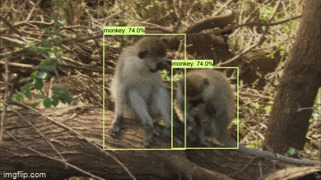

# TensorFlow Object Detection

Train and Deploy Object detection models using TensorFlow Object Detection API. This Repository uses Object detection API to train and export models to required formats along with documentation. This repository also contains some scripts for collecting and preprocessing dataset to required format.

## Requirements

### System

There is no specific requirements for inferencing from pretrained models but require GPU for training or finetuning a detection model.

### Python 3

Python 3.6 or higher. Tested with Python 3.7, 3.9 in Windows 10 and Linux.

### Packages

- `tensorflow-gpu>=2.0` or `tensorflow>=2.0`
- `numpy`
- `absl-py`
- `opencv-python`

This implementation is tested with tensorflow cpu and gpu 2.0, 2.2, 2.7 in Windows 10 and Linux

## Installation

### Install Python

There are two ways to install python in windows using [Python 3 installer](https://www.python.org/downloads/) or [Anaconda](https://docs.conda.io/projects/conda/en/latest/user-guide/install/index.html). Installing python with anaconda or [miniconda](https://docs.conda.io/en/latest/miniconda.html) is recommended. In linux Python 3 is installed by default but we can also install miniconda or conda into linux.

### Creating Virtual Environment

Create a new python virtual environment using conda or venv and activate it. If Anaconda or Miniconda is installed use `conda` else use `venv` to create virtual environments.

- Using conda

```bash
conda create --name tfod
conda activate tfod
conda install pip
```

- Using venv in linux

```bash
python3 -m venv path/to/create/env/tfod
source path/to/create/env/tfod/bin/activate
```

- Using venv in windows

```bash
python -m venv path\to\create\env\tfod
path\to\create\env\tfod\Scripts\activate
```

### Installing dependencies

#### Installing required python packages

The command below will install the required dependencies from `requirements.txt` file.

```bash
pip install -r requirements.txt
```

#### Installing tensorflow object detection API

- Clone the tensorflow model repository fro github into desired location. Tested with commit has `439d515a059740ba926ec2442299300fe52aa101`

```bash
git clone https://github.com/tensorflow/models
```

##### Linux

- Run the commands below into terminal to install

```bash
cd models/research/
protoc object_detection/protos/*.proto --python_out=.
cp object_detection/packages/tf2/setup.py .
python -m pip install .
```

##### Windows

- Download latest protoc release from [here](https://github.com/google/protobuf/releases)
- Add `<PATH_TO_Protobuf>\bin` to your Path environment variable.
- Open cmd and run

```bash
cd models/research/
```

```bash
# in windows cmd
for /f %i in ('dir /b object_detection\protos\*.proto') do protoc object_detection\protos\%i --python_out=.
# in windows powershell
Get-ChildItem object_detection/protos/*.proto | foreach {protoc "object_detection/protos/$($_.Name)" --python_out=.}
```

### Download Pretrained Object Detection Models

Object Detection model trained using TensorFlow object detection API can be downloaded from [TensorFlow Object Detection Models Zoo with coco weights](https://github.com/tensorflow/models/blob/master/research/object_detection/g3doc/tf2_detection_zoo.md) which we can finetune or train from scratch.

### Additional guides:

If get stuck in installation part follow these additional resources

- [Python Installation](https://www.youtube.com/watch?v=YYXdXT2l-Gg&list)
- [pip and usage](https://www.youtube.com/watch?v=U2ZN104hIcc)
- [Anaconda installation and using conda](https://www.youtube.com/watch?v=YJC6ldI3hWk)

## Documentation

#### Detect Objects in Image

```bash
python detect_image.py \
    --model PATH/TO/MODEL \
    --image PATH/TO/IMAGE \
    --output PATH/TO/SAVE/OUTPUT/IMAGE
```

optional argument `threshold` which neglects all detections with probability score less that that. Defaults to 0.5

#### Detect Objects in Video Feed

```bash
python detect_video.py \
    --model PATH/TO/MODEL \
    --video PATH/TO/VIDEO \
    --output PATH/TO/SAVE/OUTPUT/VIDEO
```

optional argument `threshold` which neglects all detections with probability score less that that. Defaults to 0.5

#### Detect Objects in Camera Feed

```bash
python detect_webcam.py \
    --model PATH/TO/MODEL \
    --cam 0 \
    --output PATH/TO/SAVE/OUTPUT/VIDEO
```

optional argument `threshold` which neglects all detections with probability score less that that. Defaults to 0.5

#### Training an object detection model using TfRecords

Training script is taken from `model/research/object-detection`

```bash
python train_model_tfrecords.py \
    --model_dir "PATH/TO/SAVE/CHECKPOINT/AND/EVENTS" \
    --pipeline_config_path "PATH/TO/PIPELINE/CONFIG" \
    --num_train_steps 100 \
    --checkpoint_dir "PATH/TO/CHECKPOINT/DIR" \
    --eval_training_data True \
    --sample_1_of_n_eval_examples 1 \
    --sample_1_of_n_eval_on_train_examples 5 \
    --max_eval_retries 0
```

- `sample_1_of_n_eval_on_train_examples` Will sample one of every n train input examples for evaluation, This is only used if `eval_training_data` is True. Default is 5
- `sample_1_of_n_eval_examples` Will sample one of every n eval input examples. Default is 1
- `max_eval_retries` If running continuous eval, the maximum number of retries upon encountering tf.errors.InvalidArgumentError. If negative, will always retry the evaluation.

#### Training an object detection model using Images and csv annotations

```bash
python train_model_images.py \
    --train_annotations_csv "PATH/TO/TRAIN/CSV" \
    --test_annotations_csv "PATH/TO/TEST/CSV"
    --train_images_dir "PATH/TO/TRAIN/IMAGES" \
    --test_images_dir "PATH/TO/TEST/IMAGES" \
    --labelstxt_path "PATH/TO/LABELS/TXT/FILE"  \
    --pipeline_config_path "PATH/TO/PIPELINE/CONFIG" \
    --num_train_steps 100 \
    --checkpoint_path "PATH/TO/CHECKPOINT/.ckpt" \
    --batch_size 32 \
    --early_stopping_patience 5 \
    --learning_rate 0.01 \
    --model_name "MODEL_NAME" \
    --finetune True \
    --image_width 320 \
    --image_height 320
```

### Exporting Trained model for inference

script Taken from `model/research/object-detection`

```bash
python export_model.py \
    --input_type image_tensor \
    --pipeline_config_path "path/to/ssd_model_pipeline.config" \
    --trained_checkpoint_prefix "path/to/model.ckpt" \
    --output_directory "path/to/exported_model_directory"
```

### Exporting Trained model as tflite

script taken from `model/research/object-detection`

```bash
python export_tflite.py \
    --pipeline_config_path "path/to/ssd_model/pipeline.config" \
    --trained_checkpoint_dir "path/to/ssd_model/checkpoint" \
    --output_directory "path/to/exported_model_directory"
```

### Downloading images from Duckduckgo (collecting data)

```bash
python download_images.py \
    --config PATH/TO/DOWNLOADER/JSON
```

- `config` Path to config file of downloader. Defaults to `image_downloader/config.json`

## Detection Results

<div>
  <a href="https://youtu.be/FK4kqej6t5Q"></a>
</div>

## Contributions

Contributions are highly welcome that will improve quality of project.
